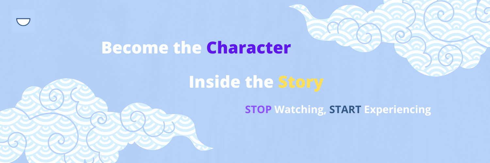

<div align="center">



# Hyperclaw

**An open, local-first dashboard for orchestrating AI coding agents and multi-channel messaging gateways.**

[](LICENSE)
[](https://nextjs.org)
[](https://www.typescriptlang.org)
[](https://www.electronjs.org)
[](#testing)

</div>

---

## What is Hyperclaw?

Hyperclaw is the dashboard you’ve always wanted on top of your AI coding agents. Spin up Claude Code, Codex, OpenClaw, and Hermes runs from one interface, watch every token stream live, manage multi-channel messaging gateways, and run it all on your own machine.

It ships in two flavors from the same codebase:

- **Community Edition** *(this repo, MIT licensed)* — runs entirely on your laptop. The web dashboard talks to a connector daemon over `localhost`, no cloud required, no telemetry by default.
- **Hyperclaw Cloud** *(hosted at hypercho.com)* — same dashboard, plus a hub for multi-device sync, hosted agents, team workspaces, and ARR analytics.

The Community Edition is *not* a feature-stripped demo. It’s the same UI we ship commercially, with the cloud-only surfaces (billing, multi-tenant hub) lifted out so you can self-host without strings attached.

> **Heads-up — alpha.** The dashboard is stable enough for daily personal use, but APIs and on-disk formats may shift before 1.0. Pin a tag if you’re building on top of it.

---

## Who is this for?

- **Coding-agent power users** running Claude Code / Codex sessions in parallel and tired of juggling terminals
- **Builders shipping multi-channel agents** (WhatsApp, Slack, Discord, etc.) through the OpenClaw gateway
- **Hackers and researchers** who want a local, scriptable, open-source mission-control panel instead of a SaaS lock-in
- **Teams** evaluating Hyperclaw Cloud who want to start on the OSS edition first

---

## Highlights

- **Live agent streaming** — Claude Code, Codex, Hermes, and OpenClaw runs render token-by-token through a unified streaming layer
- **Local-first by default** — the dashboard talks directly to a connector running on the same machine; zero outbound traffic until you opt in
- **Electron desktop app** — bundled with the connector binary for a one-click install on macOS, Windows, and Linux
- **Multi-channel intelligence panel** — browse messages, classify intent, route to agents
- **Project + workflow boards** — Kanban-style projects, issue boards, workflow templates, and team channels
- **Onboarding wizard** — guided setup for a new device, with a local-first path that skips cloud sign-in entirely
- **Bring-your-own provider** — OpenAI, Anthropic, Stripe (for *your* ARR analytics), Google OAuth, X/Twitter — all optional, all configurable via `.env`

---

## Architecture

```
┌────────────────────────┐        ┌─────────────────────────┐
│   Hyperclaw Dashboard  │        │   AI Runtimes           │
│   (Next.js / Electron) │◀──ws──▶│   claude / codex /      │
│                        │        │   openclaw / hermes     │
└──────────┬─────────────┘        └─────────────────────────┘
           │ localhost ws/http
           ▼
┌────────────────────────┐
│   Hyperclaw Connector  │  ◀── spawns CLIs, streams JSONL,
│   (Go daemon)          │      stores SQLite at ~/.hyperclaw/
└──────────┬─────────────┘
           │ optional outbound wss (Cloud edition only)
           ▼
┌────────────────────────┐
│   Hub (proprietary)    │  ⟵ Cloud Edition only — multi-device sync,
│   wss://your-hub-url   │     team workspaces, hosted agents
└────────────────────────┘
```

In Community Edition, the **connector** is the only daemon. It handles all CLI spawning locally and streams results back to the dashboard over WebSocket. The dashboard never reaches the hub unless you set `NEXT_PUBLIC_HUB_URL`.

For the deeper version of this picture (event flow, message types, store layout) see [`connector/README.md`](connector/README.md).

---

## Quick Start

### Run the dashboard from source (60 seconds)

```bash
git clone https://github.com/duolahypercho/HyperClaw.git
cd HyperClaw

# 1. Install dependencies
npm install

# 2. Copy the env template and generate a session secret
cp .env.example .env.local
echo "NEXTAUTH_SECRET=$(openssl rand -base64 32)" >> .env.local

# 3. Start the dev server
npm run dev
```

Open [http://localhost:1000](http://localhost:1000). That’s it — you should see the onboarding wizard. Pick the **local-only** path and you’re live.

### Add the connector for live AI runs

The dashboard works on its own, but to actually run Claude Code / Codex / OpenClaw sessions you need the connector daemon:

```bash
# In a second terminal
cd connector
go build -o hyperclaw-connector ./cmd
./hyperclaw-connector
```

The connector listens on `localhost` only. The dashboard discovers it automatically.

> **Don’t want to manage two terminals?** The Electron build below bundles both into one app.

### Build the Electron desktop app

```bash
# macOS
npm run electron:build:mac:local

# Windows
npm run electron:build:win:local

# Linux
npm run electron:build:linux:local
```

The bundled app ships with the connector binary baked in (see `electron/build-connector.sh`) and starts both processes on launch. Output lands in `electron/dist-electron/`.

---

## Configuration

Hyperclaw reads everything from `.env.local`. The full list (with explanations of which Edition needs what) is in [`.env.example`](.env.example). The short version:

| Variable | When you need it |
|---|---|
| `NEXTAUTH_SECRET` | **Always.** Signs session cookies. `openssl rand -base64 32`. |
| `NEXTAUTH_URL` | Always. Defaults to `http://localhost:1000`. |
| `OPENAI_API_KEY` | Only if you use the in-app text autosuggest / enhance features. |
| `S3_UPLOAD_*` | Only if you upload files / knowledge artifacts. |
| `GOOGLE_CLIENT_ID` / `_SECRET` | Only if you want Google sign-in. |
| `NEXT_PUBLIC_HUB_URL` / `_HUB_API_URL` | **Cloud Edition only.** Leave empty to stay local-first. |
| `NEXT_PUBLIC_HYPERCHO_API` | Cloud Edition only. URL of the proprietary user-manager service. |
| `NEXT_PUBLIC_CONNECTOR_RELEASES_URL` | Cloud Edition only. Where the in-app “Download connector” button points. |

Everything left blank in `.env.example` is genuinely optional. If a feature surface needs config it isn’t given, the UI tells you exactly which env var to set.

---

## Available scripts

| Command | What it does |
|---|---|
| `npm run dev` | Next.js dev server on port 1000 with hot reload |
| `npm run build` | Production Next.js build |
| `npm run start` | Run the production build on port 1000 |
| `npm run lint` | ESLint |
| `npm run electron:dev` | Electron in dev mode (loads `localhost:1000`) |
| `npm run electron:build:mac:local` | Build the macOS desktop app |
| `npm run electron:build:win:local` | Build the Windows desktop app |
| `npm run electron:build:linux:local` | Build the Linux desktop app |
| `npm run connector:build` | Build the connector binary into `electron/build/` |
| `npm run plugin:pack` | Pack the bundled OpenClaw plugin tarball |

---

## Project structure

```
hyperclaw_app/
├── pages/                 # Next.js Pages Router (routes + API)
├── components/            # Custom React components (dashboard widgets, tools, projects)
├── OS/                    # The "Hyperclaw OS" layer — sidebar, layout, AI hooks
├── Providers/             # React context providers
├── src/components/        # shadcn/ui primitives
├── lib/                   # Shared client libs (gateway WS, hub direct, env, auth)
├── services/              # HTTP clients and feature service layers
├── store/                 # Zustand stores
├── electron/              # Electron wrapper + build pipeline
├── connector/             # Vendored Go daemon (Hub <-> AI runtime relay)
├── docs/                  # Architecture, design, and integration docs
└── public/                # Static assets, fonts, downloads/install.sh
```

Path aliases:
- `$/...` → repo root (e.g. `import Foo from "$/components/Foo"`)
- `@/...` → `src/` (e.g. `import { Button } from "@/components/ui/button"`)

---

## Connector

The connector is a Go daemon that lives in [`./connector`](connector). It’s vendored into this monorepo so a fresh clone gives you everything you need to run end-to-end. It can also be built and run independently — see [`connector/README.md`](connector/README.md) for the full story (CLI spawning, OpenClaw plugin embedding, SQLite store, etc.).

In Community Edition, the connector talks only to localhost. In Cloud Edition, it additionally maintains an outbound-only WebSocket to the hub — no inbound ports are ever exposed on your machine.

---

## Validation

The public OSS tree does not ship test suites. For now, use install/build
sanity checks plus focused manual verification of the local-first flow:

```bash
npm ci
npm run lint
npm run build
cd connector && go build -o hyperclaw-connector ./cmd
```

---

## Contributing

PRs and issues welcome. The repo is moving fast — open a draft PR or an issue to chat before sinking serious time into a large change.

A few house rules:
- **Keep the local-first path working.** Any feature that requires the hub must degrade cleanly when `NEXT_PUBLIC_HUB_URL` is empty.
- **No new hardcoded `hypercho.com`, personal paths, or org-specific identifiers.** Read them from env.
- **Keep changes easy to verify.** Include manual verification steps in PRs.
- **ESLint before pushing.** `npm run lint` is currently advisory while legacy lint debt is cleaned up.

A full `CONTRIBUTING.md` is on the way.

---

## Security

Found a security issue? Please don’t open a public issue. Email the maintainer (see `package.json` author field) directly. A formal `SECURITY.md` with disclosure timelines is on the way.

---

## License

[MIT](LICENSE) — do whatever you want, just keep the copyright notice. The trademark “Hyperclaw” and the hosted Cloud service are not covered by this license.

---

## Acknowledgements

Hyperclaw stands on the shoulders of [Next.js](https://nextjs.org), [Electron](https://www.electronjs.org), [shadcn/ui](https://ui.shadcn.com), [Tailwind CSS](https://tailwindcss.com), [Framer Motion](https://www.framer.com/motion/), [Zustand](https://github.com/pmndrs/zustand), and the agent-runtime CLIs from Anthropic, OpenAI, and the OpenClaw community.
